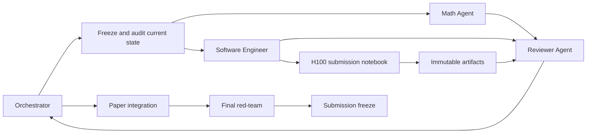

# GBDN Submission Agentic Workspace

This workspace defines the multi-agent program for turning the current GBDN repository and manuscript into a technically defensible A* machine-learning submission.

The package is designed to be copied into the root of the GBDN repository. It does **not** replace the paper, code, or results. It establishes ownership, dependencies, evidence contracts, execution gates, and the exact H100 notebook specification that the implementation agents must follow.

## Mission

Develop and validate **GBDN as a learned movable-pole, Blaschke–Cayley paraunitary graph spectral analysis architecture**, with:

1. a canonical implementation that corresponds exactly to the paper;
2. independently checked mathematical statements and proofs;
3. claim-matched experiments for tightness, finite-order approximation, heterophily, depth, oversmoothing, and oversquashing;
4. official multi-split, multi-seed benchmarks;
5. a resumable H100 notebook that runs the complete submission pipeline and regenerates every result, table, and figure;
6. an anonymized, auditable reproduction package.

The present legacy notebook and artifacts remain useful as a frozen reproduction record. They are not the final submission benchmark.

## Agents

| Agent | Primary responsibility | May edit | May not decide alone |
|---|---|---|---|
| **Orchestrator** | Dependency management, task assignment, gate decisions, integration, result freeze | Coordination files and accepted integrations | Mathematical truth or empirical conclusions without evidence |
| **Math Agent** | Theorem audit, new statements, proofs, notation, theorem-to-test contracts, LaTeX theory edits | Method, theory, proof appendix, theory specifications | Benchmark conclusions or unsupported oversquashing claims |
| **Reviewer Agent** | Adversarial proof checking, A* novelty review, claim audit, experiment/statistics audit, paper red-team | Review reports and explicitly authorized paper patches | Silent merges or invention of missing evidence |
| **Software Engineer Agent** | Canonical package, tests, benchmarks, multi-seed execution, H100 notebook, artifact generation | Source, tests, configs, scripts, notebook, generated outputs | Changing theorem statements or paper claims to fit code |

The orchestrator is the only role that merges across workstreams.

## Read order

Every agent must read these files in order:

1. [`AGENTS.md`](AGENTS.md)
2. [`00_ORCHESTRATOR.md`](00_ORCHESTRATOR.md)
3. [`01_SCIENTIFIC_CONTRACT.md`](01_SCIENTIFIC_CONTRACT.md)
4. The role-specific file
5. [`08_RESULTS_AND_ARTIFACT_SCHEMA.md`](08_RESULTS_AND_ARTIFACT_SCHEMA.md)
6. [`09_EXECUTION_BOARD.md`](09_EXECUTION_BOARD.md)

The reviewer and orchestrator must also read [`12_ASTAR_REFERENCE_MATRIX.md`](12_ASTAR_REFERENCE_MATRIX.md).

## Package map

| File | Purpose |
|---|---|
| `AGENTS.md` | Global rules that apply to every agent and every change |
| `00_ORCHESTRATOR.md` | Master state machine, dependency graph, gates, and integration protocol |
| `01_SCIENTIFIC_CONTRACT.md` | Canonical method identity, allowed claims, prohibited claims, theorem queue |
| `02_MATH_AGENT.md` | Exact work plan for mathematical audit and paper edits |
| `03_REVIEWER_AGENT.md` | Adversarial review and proof-checking protocol |
| `04_SOFTWARE_ENGINEER_AGENT.md` | Canonical implementation and benchmark plan |
| `05_H100_NOTEBOOK_SPEC.md` | Cell-by-cell contract for the new submission notebook |
| `06_EXPERIMENTS_AND_STATISTICS.md` | Claim-driven experiment matrix and statistical analysis |
| `07_PAPER_REVISION_PLAN.md` | Section-by-section paper rewrite and generated-result bindings |
| `08_RESULTS_AND_ARTIFACT_SCHEMA.md` | Immutable run artifacts, manifests, predictions, generated tables |
| `09_EXECUTION_BOARD.md` | Live task board and dependency status |
| `10_SUBMISSION_READINESS_CHECKLIST.md` | Final go/no-go checklist |
| `11_HANDOFF_TEMPLATE.md` | Mandatory handoff record for every completed task |
| `12_ASTAR_REFERENCE_MATRIX.md` | Closest A* literature, baseline obligations, and claim distinctions |
| `prompts/` | Copy-paste startup prompts for each agent |

## High-level workflow



## Non-negotiable ordering

1. **Correctness before performance.**
2. **Exact-operator claims before finite-order claims.**
3. **Mechanism studies before downstream benchmarks.**
4. **Validation-only model selection before any test evaluation.**
5. **All fixed splits and multiple seeds before comparative claims.**
6. **Generated result files before paper numbers.**
7. **Independent reviewer approval before claim promotion.**

A benchmark win cannot compensate for a failed mathematical contract, an unverified baseline, a mismatched metric, or a paper–code discrepancy.

## Target repository additions

The implementation should remain compact:

```text
src/gbdn/
    core.py
    models.py
    diagnostics.py
    experiments.py

configs/
    submission/

scripts/
    run_submission.py

notebooks/
    gbdn_submission_h100.ipynb

tests/
    test_gbdn_exact_contract.py
    test_gbdn_sparse_realization.py
    test_submission_protocol.py

results_submission/
    raw/
    aggregate/
    reports/

paper/
    generated/
```

The orchestrator may adapt paths after locating the actual LaTeX root, but must record the decision in the execution board.

## Final outputs

A submission-ready run must generate, without hand-editing:

- exact mathematical contract report;
- response-fitting and pole-geometry results;
- official heterophily tables over all fixed splits and at least three seeds;
- depth, rank, and sensitivity analyses;
- oversquashing/long-range results on dedicated tasks;
- optional official LRGB results;
- paired statistical tests and confidence intervals;
- runtime, memory, parameter, and sparse-operation accounting;
- learned root, pole, and spectral-response artifacts;
- paper-ready `.tex`, `.csv`, `.pdf`, and `.png` outputs;
- a complete run manifest and verification report.

Start the program with `prompts/ORCHESTRATOR_PROMPT.md`.
